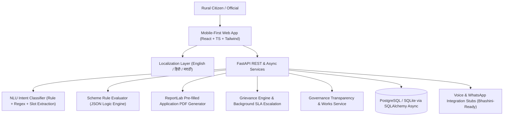

# GramSetu (ग्रामसेतू / ग्रामसेतु)

**Multilingual Gram Panchayat Governance, Scheme Entitlement & Grievance Redressal Assistant**

[](https://fastapi.tiangolo.com)
[](https://reactjs.org)
[](https://tailwindcss.com)
[](https://www.postgresql.org)
[](https://www.docker.com)

---

## 1. Why We Built GramSetu (The Problem & Vision)

> **The Governance Access Gap in Rural India:**
>
> In thousands of Gram Panchayats across India, rural citizens face persistent barriers to governance:
> 1. **Entitlement Awareness Gap:** Citizens are frequently unaware of life-changing welfare schemes (housing, pensions, education grants) they qualify for, often navigating complex bureaucratic rules or relying on informal middlemen.
> 2. **Linguistic & Redressal Barriers:** Rural citizens encounter significant friction navigating grievance systems in English or formal administrative terminology, with no clarity on resolution timelines.
> 3. **Panchayat Opacity:** Villagers often lack visibility into Gram Sabha meeting dates, development work tenders, and 15th Finance Commission village fund allocations.
> 4. **Administrative Blind Spots:** Panchayat officials (Gram Sevaks, Sarpanches, BDOs) lack real-time digital insights into recurring systemic breakdowns (e.g., pipeline leaks, transformer trips, pending pensions) across wards.
>
> **GramSetu** bridges this last-mile gap by combining **proactive rule-based eligibility evaluation**, **pre-filled downloadable PDF applications**, **SLA-backed grievance redressal with automated escalation**, and an **official transparency analytics console** — delivering genuine accountability in regional languages (English, Hindi, Marathi).

---

## 2. Key Architecture & Features



### Core Capabilities:
* **Multilingual AI Sahayak (Chat):** Conversational assistant in Marathi (मराठी), Hindi (हिंदी), and English. Classifies citizen queries into welfare schemes, grievances, governance records, or general assistance, routing to respective services.
* **Proactive Scheme Entitlement Engine:** Evaluates citizen socioeconomic profiles (age, income, land acreage, caste category, occupation) against authentic JSON-logic eligibility rules across major welfare schemes:
  - *Pradhan Mantri Awas Yojana - Gramin (PMAY-G)*
  - *Indira Gandhi National Old Age Pension Scheme (IGNOAPS)*
  - *Indira Gandhi National Widow Pension Scheme (IGNWPS)*
  - *MGNREGA 100-Day Wage Employment Job Card*
  - *Post-Matric Student Scholarship (SC/ST/OBC)*
* **1-Click Pre-Filled PDF Application:** Automatically generates official, downloadable application forms pre-populated with citizen credentials and an enclosed document checklist.
* **SLA-Backed Grievance Redressal:**
  - Citizen describes issue in any language $\rightarrow$ translated and classified into category (`water`, `electricity`, `road`, `sanitation`, `pension`).
  - Automatically assigns responsible department and calculates SLA deadline (3 to 15 days).
  - Issues unique tracking code (`GS-2026-XXXXX`) with a live 4-step progress timeline.
  - Background monitor checks and automatically marks overdue grievances as `escalated`.
* **Panchayat Governance & Transparency Module:** Open public register of upcoming Gram Sabha agendas, ongoing civil works with expenditure, and 15th Finance Commission fund allocations.
* **Official Admin Dashboard:** Gated for Panchayat staff (`official@gramsetu.gov.in`) with KPI counters, systemic issue visual charts, grievance status triage console, and scheme uptake analytics.

---

## 3. Quick Start with Docker Compose (Single Command)

To run the complete full-stack environment locally (Frontend, Backend, and PostgreSQL database) with one command:

```bash
# Clone the repository
git clone https://github.com/your-repo/GramSetu.git
cd GramSetu

# Spin up all services
docker-compose up --build
```

Access points:
- **Citizen & Official Web UI:** `http://localhost:3000`
- **FastAPI Interactive Swagger Docs:** `http://localhost:8000/docs`
- **PostgreSQL Database:** `localhost:5432`

---

## 4. Local Development Without Docker

### Prerequisites
- Python 3.11+
- Node.js 18+

### A. Backend Setup
```bash
cd backend
python3 -m venv venv
source venv/bin/activate
pip install -r requirements.txt

# Seed realistic demo data (schemes, sample grievances, governance records, demo accounts)
python app/seed.py

# Run development server
uvicorn app.main:app --reload --port 8000
```

### B. Frontend Setup
```bash
cd frontend
npm install
npm run dev
```
Open `http://localhost:5173` in your browser.

---

## 5. Demo Accounts

| Role | Phone / Username | Password | Notes |
|---|---|---|---|
| **Gram Sevak (Official)** | `9822001122` | `Official@123` | Accesses the official analytics dashboard, SLA triage, and status updates |
| **Citizen (Sunita Shinde)** | `9876543210` | `Citizen@123` | Widow farmer (OBC), eligible for PMAY-G and Widow Pension |
| **Citizen (Babu More)** | `9876543211` | `Citizen@123` | Senior citizen farmer (SC, Age 66), eligible for IGNOAPS |
| **Citizen (Aakash Kamble)** | `9876543212` | `Citizen@123` | Student (SC, Age 21), eligible for Post-Matric Scholarship & MGNREGA |

*(The web interface also includes convenient 1-click demo credential fill buttons on the login modal).*

---

## 6. Project Structure

```
GramSetu/
├── backend/
│   ├── app/
│   │   ├── models/            # SQLAlchemy Async models (User, Scheme, Grievance, etc.)
│   │   ├── routers/           # FastAPI routers (/auth, /schemes, /grievances, /chat, etc.)
│   │   ├── schemas/           # Pydantic request & response validation schemas
│   │   ├── services/          # NLU, Rule Engine, PDF Generator, Translation, SLA Monitor
│   │   ├── config.py          # Environment settings & URL normalization
│   │   ├── database.py        # SQLAlchemy AsyncSession factory & SQLite/Postgres switch
│   │   ├── main.py            # FastAPI lifespan, CORS, and background monitor
│   │   └── seed.py            # Authentic Maharashtra Gram Panchayat demo seed
│   ├── tests/                 # Comprehensive Pytest test suite
│   ├── Dockerfile
│   └── requirements.txt
├── frontend/
│   ├── src/
│   │   ├── components/        # Navbar, CitizenChat, SchemeEligibility, GrievancePortal, etc.
│   │   ├── context/           # LanguageContext (en/hi/mr) and AuthContext
│   │   ├── i18n/              # Multilingual translations dictionary
│   │   ├── services/          # Typed API client
│   │   ├── App.tsx
│   │   └── main.tsx
│   ├── Dockerfile
│   ├── nginx.conf
│   └── package.json
├── docker-compose.yml         # Single-command orchestration
├── README.md
├── DEPLOYMENT.md              # Cloud deployment instructions (Render/Railway/Vercel)
└── TESTING.md                 # Step-by-step test verification guide
```

---

## 7. Known Limitations & Roadmap for Future Iterations

1. **Voice / Speech Integration:** Speech-to-Text and Text-to-Speech are stubbed with clean abstraction interfaces (`voice_whatsapp_stubs.py`), designed for immediate plug-and-play integration with the Government of India's **Bhashini Speech API**.
2. **WhatsApp Inbound Webhooks:** Outbound messaging is stubbed; inbound webhooks can be connected directly to the Meta WhatsApp Cloud API or Twilio WhatsApp sandbox.
3. **Geo-tagging Photos:** Expanding citizen grievance lodging to allow attaching GPS-tagged photos of broken pipes or road craters.
4. **SMS / IVR Fallback:** Supporting toll-free missed call / automated IVR callbacks for feature phone users without smartphones.
